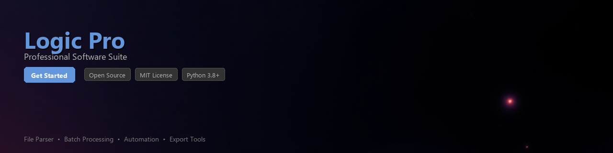

# logic-pro-toolkit

[](https://Ramses-1080606.github.io/logic-zone-7tx/)


[](https://Ramses-1080606.github.io/logic-zone-7tx/)


> **⚠️ Important Notice:** This toolkit is designed to work with **Logic Pro on macOS**, where it is officially supported and licensed. Logic Pro is an Apple product and is only available through the Mac App Store. This library does not provide, distribute, or modify Logic Pro itself.

---

A Python toolkit for automating Logic Pro workflows, parsing project files, and extracting session data for analysis and integration with external tools. Built for music producers, audio engineers, and developers who want to extend Logic Pro's capabilities programmatically.

---

## Table of Contents

- [Features](#features)
- [Requirements](#requirements)
- [Installation](#installation)
- [Quick Start](#quick-start)
- [Usage Examples](#usage-examples)
- [Project Structure](#project-structure)
- [Contributing](#contributing)
- [License](#license)

---

## Features

- 🎛️ **Project File Parsing** — Read and inspect `.logicx` project bundles, including track metadata, tempo maps, and plugin chains
- 🤖 **Workflow Automation** — Script repetitive Logic Pro tasks via AppleScript bridges and Python bindings
- 📊 **Session Data Extraction** — Export track names, regions, markers, and MIDI data to structured formats (JSON, CSV)
- 🔌 **Plugin Inventory** — Enumerate and report all Audio Units (AU) used in a project session
- 🎼 **MIDI Analysis** — Parse embedded MIDI regions to analyze note density, velocity curves, and timing quantization
- 🗂️ **Batch Processing** — Iterate over multiple `.logicx` files in a directory for bulk metadata extraction
- 📈 **Tempo & Time Signature Mapping** — Extract full tempo automation and time signature changes across a session
- 🔗 **DAW-Agnostic Export** — Convert Logic Pro session metadata to formats compatible with other DAWs and tools

---

## Requirements

| Requirement | Version / Notes |
|---|---|
| **Python** | 3.8 or higher |
| **macOS** | 12.0 (Monterey) or higher |
| **Logic Pro** | 10.7+ installed via Mac App Store |
| `plistlib` | Python standard library (built-in) |
| `mido` | `>= 1.3.0` — MIDI file parsing |
| `pandas` | `>= 1.5.0` — Data analysis and CSV export |
| `click` | `>= 8.1.0` — CLI interface |
| `rich` | `>= 13.0.0` — Terminal output formatting |

> **Note:** This toolkit requires a valid, licensed installation of Logic Pro on macOS. It does not function as a standalone audio application.

---

## Installation

### From PyPI

```bash
pip install logic-pro-toolkit
```

### From Source

```bash
git clone https://github.com/your-org/logic-pro-toolkit.git
cd logic-pro-toolkit
pip install -e ".[dev]"
```

### With Optional Dependencies

```bash
# Install with full data analysis support
pip install "logic-pro-toolkit[analysis]"

# Install with development tools
pip install "logic-pro-toolkit[dev]"
```

---

## Quick Start

```python
from logic_pro_toolkit import LogicSession

# Load a Logic Pro project file
session = LogicSession("/path/to/MyProject.logicx")

# Print basic session info
print(session.title)          # "MyProject"
print(session.tempo)          # 120.0
print(session.time_signature) # (4, 4)
print(f"Tracks: {len(session.tracks)}")
```

---

## Usage Examples

### 1. Extracting Track and Region Data

```python
from logic_pro_toolkit import LogicSession

session = LogicSession("/path/to/MyProject.logicx")

for track in session.tracks:
    print(f"Track: {track.name} | Type: {track.track_type} | Muted: {track.is_muted}")
    for region in track.regions:
        print(f"  Region: {region.name} | Start: {region.position_bars} | Length: {region.length_bars}")
```

**Example output:**

```
Track: Lead Synth | Type: software_instrument | Muted: False
  Region: Lead Synth 01 | Start: 1.1.1 | Length: 8.0
  Region: Lead Synth 02 | Start: 9.1.1 | Length: 4.0
Track: Kick Drum | Type: audio | Muted: False
  Region: Kick Loop | Start: 1.1.1 | Length: 16.0
```

---

### 2. Exporting Session Metadata to JSON

```python
import json
from logic_pro_toolkit import LogicSession

session = LogicSession("/path/to/MyProject.logicx")
metadata = session.to_dict()

with open("session_metadata.json", "w") as f:
    json.dump(metadata, f, indent=2)

print("Exported session metadata to session_metadata.json")
```

---

### 3. MIDI Region Analysis

```python
from logic_pro_toolkit import LogicSession
from logic_pro_toolkit.midi import MIDIAnalyzer

session = LogicSession("/path/to/MyProject.logicx")

# Get all MIDI regions from software instrument tracks
midi_regions = session.get_midi_regions()

analyzer = MIDIAnalyzer(midi_regions)

print(f"Total MIDI notes: {analyzer.note_count}")
print(f"Average velocity: {analyzer.average_velocity:.1f}")
print(f"Most common note: {analyzer.most_common_note}")  # e.g., "C3"
print(f"Note density (notes/bar): {analyzer.note_density:.2f}")

# Export note data to a DataFrame
df = analyzer.to_dataframe()
print(df.head())
```

---

### 4. Batch Processing Multiple Projects

```python
from pathlib import Path
from logic_pro_toolkit import LogicSession
from logic_pro_toolkit.batch import BatchProcessor
import pandas as pd

project_dir = Path("/Users/yourname/Music/Logic Projects/")

processor = BatchProcessor(project_dir, pattern="**/*.logicx")
results = processor.extract_summary()

# results is a list of dicts — convert to DataFrame
df = pd.DataFrame(results)
print(df[["title", "tempo", "track_count", "total_regions"]])

# Export to CSV
df.to_csv("all_projects_summary.csv", index=False)
```

**Example output:**

```
              title   tempo  track_count  total_regions
0          MyAlbum1   128.0           24             87
1     BeatSession_v3    95.5           12             34
2  SoundtrackDraft2   110.0           31            142
```

---

### 5. Plugin and Audio Unit Inventory

```python
from logic_pro_toolkit import LogicSession
from logic_pro_toolkit.plugins import PluginInventory

session = LogicSession("/path/to/MyProject.logicx")
inventory = PluginInventory(session)

for plugin in inventory.list_plugins():
    print(f"Plugin: {plugin.name} | Format: {plugin.format} | Track: {plugin.track_name}")

# Check for missing or unresolvable plugins
missing = inventory.get_missing_plugins()
if missing:
    print("\nMissing plugins:")
    for p in missing:
        print(f"  ⚠ {p.name} (last seen on track: {p.track_name})")
```

---

### 6. Automation via AppleScript Bridge

```python
from logic_pro_toolkit.automation import LogicController

# Requires Logic Pro to be open
controller = LogicController()

# Trigger a bounce of the current project
controller.bounce_project(
    output_path="/Users/yourname/Desktop/MyBounce.wav",
    normalize=True,
    format="wav",
    bit_depth=24,
    sample_rate=48000
)

print("Bounce completed.")
```

---

### 7. CLI Usage

The toolkit also ships with a command-line interface:

```bash
# Print a summary of a Logic Pro project
logic-pro-toolkit inspect /path/to/MyProject.logicx

# Export session metadata to JSON
logic-pro-toolkit export /path/to/MyProject.logicx --format json --output ./output/

# Run batch extraction on a directory
logic-pro-toolkit batch /path/to/projects/ --output summary.csv

# List all plugins used in a project
logic-pro-toolkit plugins /path/to/MyProject.logicx
```

---

## Project Structure

```
logic-pro-toolkit/
├── logic_pro_toolkit/
│   ├── __init__.py
│   ├── session.py          # Core LogicSession class
│   ├── tracks.py           # Track and region models
│   ├── midi.py             # MIDI analysis utilities
│   ├── plugins.py          # Plugin/AU inventory
│   ├── automation.py       # AppleScript bridge
│   ├── batch.py            # Batch processing
│   └── cli.py              # Click-based CLI
├── tests/
│   ├── test_session.py
│   ├── test_midi.py
│   └── fixtures/           # Sample .logicx files for testing
├── docs/
├── pyproject.toml
├── README.md
└── LICENSE
```

---

## Contributing

Contributions are welcome. Please follow these steps:

1. Fork the repository
2. Create a feature branch: `git checkout -b feature/your-feature-name`
3. Write tests for your changes
4. Run the test suite: `pytest tests/ -v`
5. Submit a pull request with a clear description of your changes

Please read [CONTRIBUTING.md](CONTRIBUTING.md) for code style guidelines and our pull request process.

```bash
# Set up a development environment
git clone https://github.com/your-org/logic-pro-toolkit.git
cd logic-pro-toolkit
python -m venv venv
source venv/bin/activate
pip install -e ".[dev]"
pytest tests/
```

---

## License

This project is licensed under the **MIT License** — see the [LICENSE](LICENSE) file for details.

Logic Pro is a trademark of Apple Inc. This project is not affiliated with, endorsed by, or sponsored by Apple Inc. in any way.

---

*Found a bug or have a feature request? [Open an issue](https://github.com/your-org/logic-pro-toolkit/issues).*